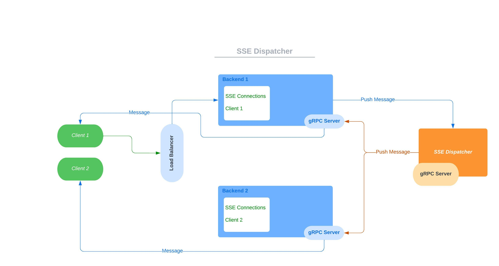

<h1 style="text-align: center">SSE Dispatcher</h1>



<h2 style="text-align: left">What is this project</h2>
<p>This project is a simple implementation of a server-sent events dispatcher.</p> 
<p>It is composed of a backend and a dispatcher.</p>
<p>The backend is a simple HTTP server that has two endpoints:</p>
<ul>
<li>GET &nbsp;&nbsp;/sse?client=[identification of the client]: creates a channel for SSE messages</li>
<li>POST /push-message: push message to clients</li>
</ul>
<p>The dispatcher is a gRPC server that receives the messages from the backend and sends them to the clients that are connected to it.</p>

<h2 style="text-align: left">How to use this project</h2>
<p>1) Create a docker image of the backend</p>

```docker image build ./backend --tag backend:v1.0.0```

<p>2) Create a docker image of the dispatcher</p>

```docker image build ./dispatcher --tag dispatcher:v1.0.0```

<p>3) Run docker compose</p>

```docker-compose up -d --remove-orphans --scale backend=2```